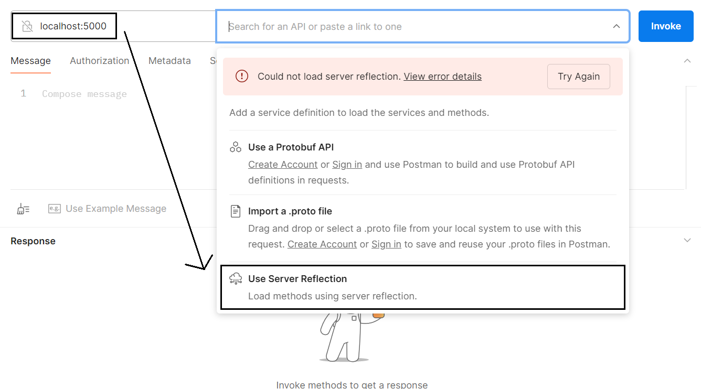
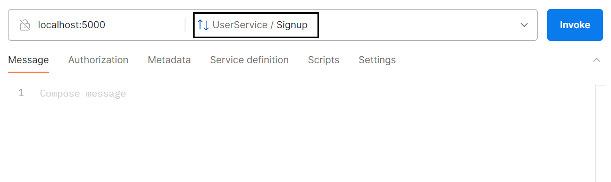

# User Service gRPC API

## Project Description

This project is a gRPC-based user service implemented in Go. It allows for user signup and provides various functionalities to fetch user details. The service includes the following features:
- User signup
- Fetch user details by ID
- Fetch user details by a list of IDs
- Get all user IDs
- Search for users based on specific criteria

The service is dockerized for ease of deployment.

## Endpoints and Usage

### 1. Signup
**Endpoint:** `Signup`

**Description:** Registers a new user.

**Request Payload:**
```json
{
  "fname": "Steve",
  "city": "LA",
  "phone": 1234567890,
  "height": "5.8",
  "married": true
}
```

**Response:**
```json
{
  "person": {
    "id": "generated-uuid",
    "fname": "Steve",
    "city": "LA",
    "phone": 1234567890,
    "height": "5.8",
    "married": true
  }
}
```

### 2. SearchUserById
**Endpoint:** `SearchUserById`

**Description:** Fetches user details by their ID.

**Request Payload:**
```json
{
  "id": "user-id"
}
```

**Response:**
```json
{
  "person": {
    "id": "user-id",
    "fname": "Steve",
    "city": "LA",
    "phone": 1234567890,
    "height": "5.8",
    "married": true
  }
}
```

### 3. SearchUsersByIds
**Endpoint:** `SearchUsersByIds`

**Description:** Fetches user details by a list of IDs.

**Request Payload:**
```json
{
  "ids": ["user-id1", "user-id2"]
}
```

**Response:**
```json
{
  "people": [
    {
      "id": "user-id1",
      "fname": "Steve",
      "city": "LA",
      "phone": 1234567890,
      "height": "5.8",
      "married": true
    },
    {
      "id": "user-id2",
      "fname": "Alice",
      "city": "NY",
      "phone": 9876543210,
      "height": "5.7",
      "married": false
    }
  ]
}
```

### 4. GetAllUserIds
**Endpoint:** `GetAllUserIds`

**Description:** Fetches all user IDs.

**Request Payload:** None

**Response:**
```json
{
  "ids": ["user-id1", "user-id2", "user-id3"]
}
```

### 5. SearchUsers
**Endpoint:** `SearchUsers`

**Description:** Searches for users based on specific criteria.

**Request Payload:**
```json
{
  "fname": "Steve",
  "city": "LA",
  "phone": 1234567890,
  "height": "5.8",
  "married": true
}
```

**Response:**
```json
{
  "people": [
    {
      "id": "user-id1",
      "fname": "Steve",
      "city": "LA",
      "phone": 1234567890,
      "height": "5.8",
      "married": true
    }
  ]
}
```
### Running Test 
```
go test ./cmd/ -v
```
## Running the Service

### Prerequisites
- Docker
- Docker Compose

### Steps
1. **Build the Docker image:**
   ```sh
   docker-compose build
   ```

2. **Start the service:**
   ```sh
   docker-compose up
   ```

The service will be available on `localhost:5000`.

## Additional Notes

- The service leverages gRPC reflection for testing with tools like Postman.

## Steps to use in Postman
- 1. 

   
- 2. 

   
- 3. 
